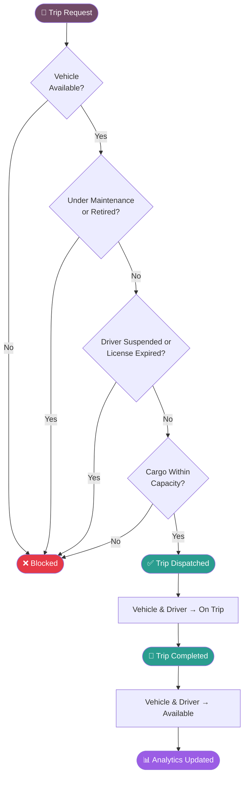
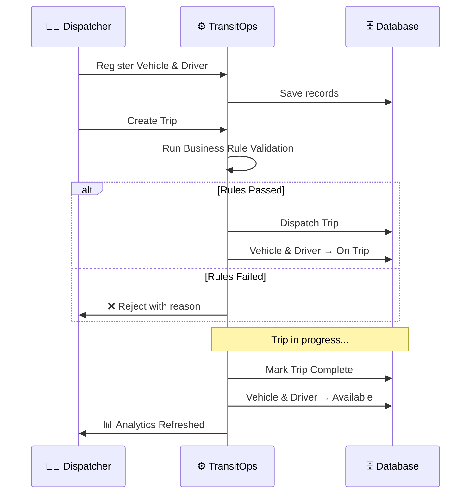
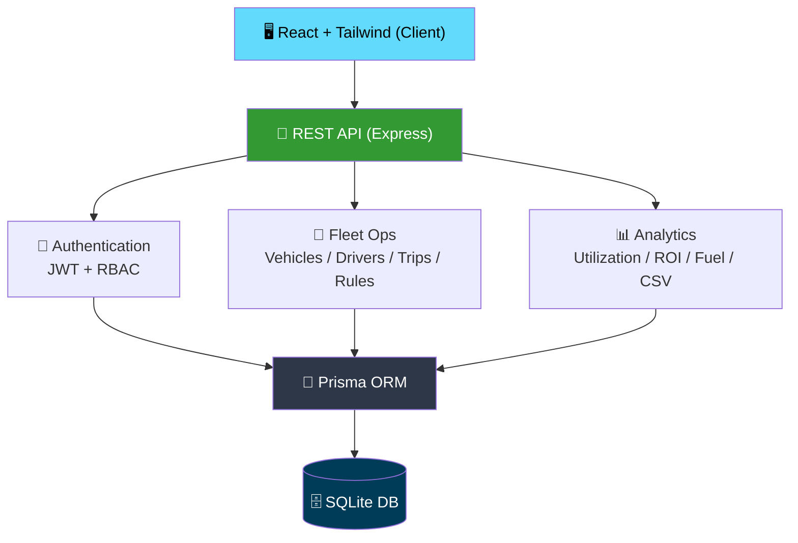

<div align="center">


<a href="https://github.com/<your-username>/TransitOps">

</a>

<br/>


<br/><br/>

/TransitOps?style=for-the-badge&color=9B5DE5"/>
/TransitOps?style=for-the-badge&color=714B67"/>


<br/><br/>


</div>

<br/>

## 📖 Table of Contents

<div align="center">

[The Problem](#-the-problem) • [Why TransitOps](#-why-transitops) • [Features](#-key-features) • [Business Rules](#-business-rules-it-enforces) • [Workflow](#%EF%B8%8F-system-workflow) • [Architecture](#%EF%B8%8F-architecture) • [Screenshots](#-screenshots) • [Tech Stack](#-tech-stack) • [Quick Start](#-quick-start) • [Team](#-team)

</div>

<br/>

## 🌍 The Problem


Most logistics companies still run their fleets off spreadsheets and manual coordination — vehicles, drivers, maintenance, and dispatch tracked by hand across scattered sheets and side conversations.

<table>
<tr>
<td width="50%" valign="top">

**🔴 The old way**
- Double-booked vehicles
- Drivers going out with expired licenses
- Overloaded cargo
- Missed maintenance windows
- Zero real-time visibility

</td>
<td width="50%" valign="top">

**🟢 The TransitOps way**
- One source of truth for the whole fleet
- Rules enforced automatically, every time
- Live status for every vehicle & driver
- Maintenance tracked, not forgotten
- Analytics that update in real time

</td>
</tr>
</table>

<br clear="right"/>

---

## ✨ Why TransitOps?

> It's not just another CRUD app. TransitOps enforces **real business logic** — every action is validated before it executes, so operational safety doesn't depend on someone remembering the rules.

<div align="center">

| 🚫 Without TransitOps | ✅ With TransitOps |
|:---|:---|
| Manual double-checking | Automatic validation |
| Spreadsheet chaos | Centralized dashboard |
| Reactive maintenance | Proactive tracking |
| Guesswork on ROI | Real ROI analytics |

</div>

---

## 🎯 Key Features

<div align="center">
<table>
<tr>
<td align="center" width="33%">
<h3>🚛</h3>
<b>Fleet</b>
<br/><br/>
Vehicle Registry<br/>
Driver Registry<br/>
Maintenance Logs<br/>
Fuel Tracking<br/>
Expense Tracking
</td>
<td align="center" width="33%">
<h3>🚦</h3>
<b>Dispatch</b>
<br/><br/>
Smart Trip Dispatch<br/>
Auto Status Updates<br/>
Cargo Validation<br/>
Driver Validation<br/>
Lifecycle Management
</td>
<td align="center" width="33%">
<h3>📊</h3>
<b>Analytics</b>
<br/><br/>
Fleet Utilization<br/>
Vehicle ROI<br/>
Fuel Efficiency<br/>
Revenue Insights<br/>
CSV Export
</td>
</tr>
</table>
</div>

---

## 🧠 Business Rules It Enforces

<div align="center">



</div>

Every workflow gets checked against these rules before it's allowed to execute — this is the part we spent most of our build time on.

---

## ⚙️ System Workflow



---

## 🏗️ Architecture



---

## 📸 Screenshots

<div align="center">

<details open>
<summary><b>🖥️ Dashboard & Fleet Overview</b></summary>
<br/>

| Dashboard | Fleet |
|:---:|:---:|
|  |  |

</details>

<details>
<summary><b>🚦 Dispatcher & 📊 Analytics</b></summary>
<br/>

| Dispatcher | Analytics |
|:---:|:---:|
|  |  |

</details>

</div>

---

## 📈 Dashboard at a Glance

<div align="center">

| Metric | Tracked |
|---|:---:|
| Fleet Utilization | ✅ |
| Active Trips | ✅ |
| Vehicle Status | ✅ |
| Driver Availability | ✅ |
| Fuel Efficiency | ✅ |
| Revenue Analytics | ✅ |
| ROI per Vehicle | ✅ |
| Operational Cost | ✅ |

</div>

---

## 🛠 Tech Stack

<div align="center">


<br/><br/>

| Layer | Technology |
|:---:|:---:|
| Frontend | React · Vite · Tailwind CSS |
| Backend | Node.js · Express |
| ORM | Prisma |
| Database | SQLite |
| Authentication | JWT |
| Validation | Zod |

</div>

---

## 🚀 Quick Start

<table>
<tr>
<td>

**1. Clone the repo**
```bash
git clone https://github.com/<your-username>/TransitOps.git
```

</td>
</tr>
<tr>
<td>

**2. Start the backend**
```bash
cd server
npm install
npm run db:migrate
npm run db:seed
npm run dev
```

</td>
</tr>
<tr>
<td>

**3. Start the frontend**
```bash
cd client
npm install
npm run dev
```

</td>
</tr>
</table>

<div align="center">
<sub>💡 Backend runs on <code>localhost:5000</code> · Frontend on <code>localhost:5173</code></sub>
</div>

---

## 📂 Project Structure

```text
TransitOps
│
├── client
│   ├── components
│   ├── pages
│   ├── hooks
│   └── services
│
├── server
│   ├── auth
│   ├── middleware
│   ├── modules
│   ├── prisma
│   └── utils
│
└── README.md
```

---

## 👥 Team

<div align="center">

<table>
<tr>
<td align="center" width="25%">
<br/>
<b>Aman Jaiswal</b><br/>
<sub>Analytics • Integration</sub>
</td>
<td align="center" width="25%">
<br/>
<b>Ayush Awasthi</b><br/>
<sub>Frontend • UI/UX</sub>
</td>
<td align="center" width="25%">
<br/>
<b>Neel Lapsiwala</b><br/>
<sub>Backend • Authentication</sub>
</td>
<td align="center" width="25%">
<br/>
<b>Rohit Prajapat</b><br/>
<sub>Fleet Logic • Dispatch Engine</sub>
</td>
</tr>
</table>

</div>

---

<div align="center">


### ⭐ Built with passion for Odoo Hackathon 2026

**"Automating Logistics. Empowering Fleet Operations."**

If you like this project, don't forget to star the repository ⭐

</div>
