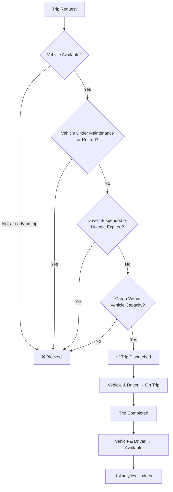
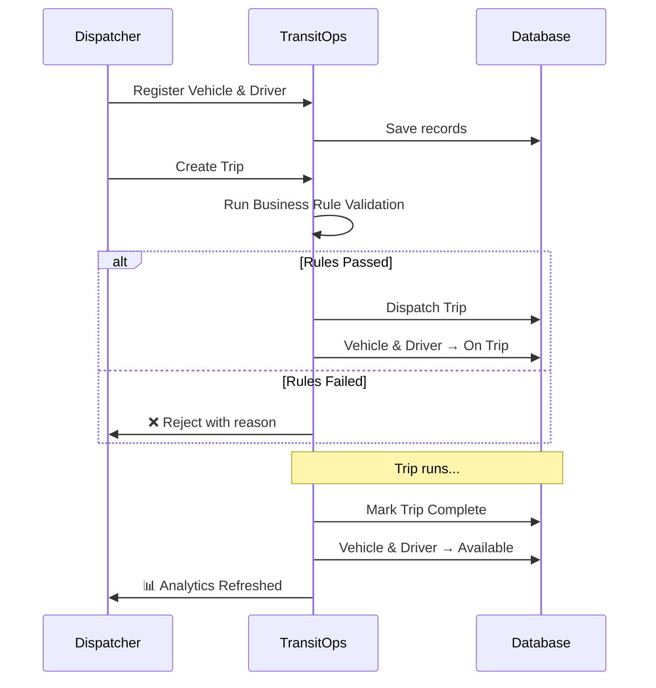

<div align="center">


<a href="https://github.com/<your-username>/TransitOps">

</a>

<br/><br/>


<br/><br/>

/TransitOps?style=social"/>
/TransitOps?style=social"/>


</div>

<br/>

---

## 🌍 The Problem

Most logistics companies still run their fleets off spreadsheets and manual coordination — vehicles, drivers, maintenance schedules, and dispatch all tracked by hand across different sheets and side conversations.

<table>
<tr>
<td width="50%" valign="top">

**What that usually looks like:**
- 🔴 Double-booked vehicles
- 🔴 Drivers going out with expired licenses
- 🔴 Overloaded cargo
- 🔴 Missed maintenance windows
- 🔴 Zero real-time visibility

</td>
<td width="50%" valign="top">

**What TransitOps does instead:**
- 🟢 One source of truth for the whole fleet
- 🟢 Rules enforced automatically, every time
- 🟢 Live status for every vehicle & driver
- 🟢 Maintenance tracked, not forgotten
- 🟢 Analytics that update in real time

</td>
</tr>
</table>

---

## ✨ Why TransitOps?

> It's not just another CRUD app. TransitOps enforces **real business logic** — every action is validated before it executes, so operational safety doesn't depend on someone remembering the rules.

<div align="center">

| 🚫 Without TransitOps | ✅ With TransitOps |
|:---:|:---:|
| Manual double-checking | Automatic validation |
| Spreadsheet chaos | Centralized dashboard |
| Reactive maintenance | Proactive tracking |
| Guesswork on ROI | Real ROI analytics |

</div>

---

## 🎯 Key Features

<table>
<tr>
<th align="center">🚛 Fleet</th>
<th align="center">🚦 Dispatch</th>
<th align="center">📊 Analytics</th>
</tr>
<tr>
<td valign="top">

- Vehicle Registry
- Driver Registry
- Maintenance Logs
- Fuel Tracking
- Expense Tracking

</td>
<td valign="top">

- Smart Trip Dispatch
- Auto Status Updates
- Cargo Validation
- Driver Validation
- Lifecycle Management

</td>
<td valign="top">

- Fleet Utilization
- Vehicle ROI
- Fuel Efficiency
- Revenue Insights
- CSV Export

</td>
</tr>
</table>

---

## 🧠 Business Rules It Enforces

<div align="center">



</div>

Every workflow gets checked against these rules before it's allowed to execute — this is the part we spent most of our build time on.

---

## ⚙️ System Workflow



---

## 🏗️ Architecture

```text
                         React + Tailwind (Client)
                                   │
                                   ▼
                         REST API (Express)
                                   │
                 ┌─────────────────┼─────────────────┐
                 ▼                 ▼                 ▼
          Authentication       Fleet Ops         Analytics
           (JWT + RBAC)     (Vehicles/Drivers/   (Utilization,
                                Trips/Rules)      ROI, Fuel, CSV)
                 │                 │                 │
                 └─────────────────┼─────────────────┘
                                   ▼
                              Prisma ORM
                                   │
                                   ▼
                              SQLite DB
```

---

## 📸 Screenshots

<div align="center">

<details open>
<summary><b>Dashboard & Fleet Overview</b></summary>
<br/>

| Dashboard | Fleet |
|:---:|:---:|
|  |  |

</details>

<details>
<summary><b>Dispatcher & Analytics</b></summary>
<br/>

| Dispatcher | Analytics |
|:---:|:---:|
|  |  |

</details>

</div>

---

## 📈 Dashboard at a Glance

<div align="center">

| Metric | Tracked |
|---|:---:|
| Fleet Utilization | ✅ |
| Active Trips | ✅ |
| Vehicle Status | ✅ |
| Driver Availability | ✅ |
| Fuel Efficiency | ✅ |
| Revenue Analytics | ✅ |
| ROI per Vehicle | ✅ |
| Operational Cost | ✅ |

</div>

---

## 🛠 Tech Stack

<div align="center">

| Layer | Technology |
|:---:|:---:|
| Frontend | React · Vite · Tailwind CSS |
| Backend | Node.js · Express |
| ORM | Prisma |
| Database | SQLite |
| Authentication | JWT |
| Validation | Zod |

</div>

---

## 🚀 Quick Start

### 1. Clone

```bash
git clone https://github.com/<your-username>/TransitOps.git
```

### 2. Backend

```bash
cd server
npm install
npm run db:migrate
npm run db:seed
npm run dev
```

### 3. Frontend

```bash
cd client
npm install
npm run dev
```

<div align="center">
<sub>💡 Backend runs on <code>localhost:5000</code> · Frontend on <code>localhost:5173</code></sub>
</div>

---

## 📂 Project Structure

```text
TransitOps
│
├── client
│   ├── components
│   ├── pages
│   ├── hooks
│   └── services
│
├── server
│   ├── auth
│   ├── middleware
│   ├── modules
│   ├── prisma
│   └── utils
│
└── README.md
```

---

## 👥 Team

<div align="center">

<table>
<tr>
<td align="center">
<b>Aman Jaiswal</b><br/>
<sub>Analytics • Integration</sub>
</td>
<td align="center">
<b>Ayush Awasthi</b><br/>
<sub>Frontend • UI/UX</sub>
</td>
<td align="center">
<b>Neel Lapsiwala</b><br/>
<sub>Backend • Authentication</sub>
</td>
<td align="center">
<b>Rohit Prajapat</b><br/>
<sub>Fleet Logic • Dispatch Engine</sub>
</td>
</tr>
</table>

</div>

---

<div align="center">


### ⭐ Built with passion for Odoo Hackathon 2026

**"Automating Logistics. Empowering Fleet Operations."**

If you like this project, don't forget to star the repository ⭐

</div>
